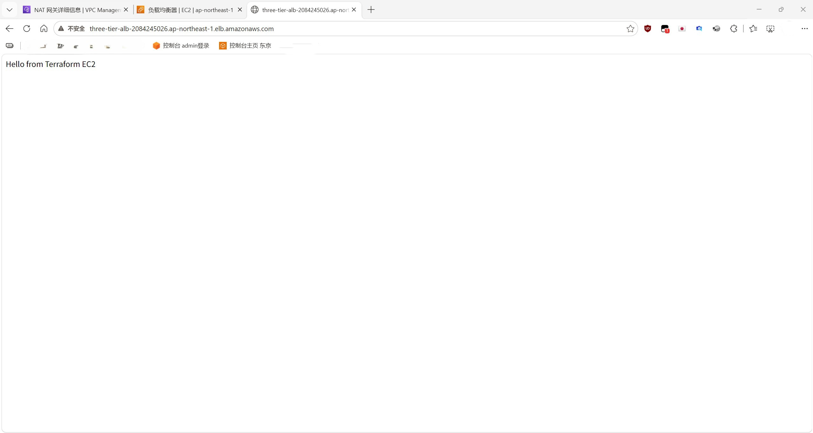

# AWS Three-Tier Architecture with Terraform 基于 AWS 和 Terraform 的三层架构
A highly available three-tier web application infrastructure deployed on AWS using Terraform.
这是一个基于 AWS 和 Terraform 部署的三层 Web 应用架构

## Overview 概述

This project demonstrates how to deploy a three-tier architecture on AWS using Infrastructure as Code (IaC) with Terraform.
本项目演示了如何使用 Terraform 通过“基础设施即代码”（IaC）在 AWS 上部署三层架构。

The architecture includes:
该架构包括：

- Web Tier: Application Load Balancer
- Web 层：应用程序负载均衡器

- Application Tier: EC2 Auto Scaling Group
- 应用层：EC2 自动扩展组

- Database Tier: Amazon RDS MySQL
- 数据库层：亚马逊 RDS MySQL

The infrastructure is designed with AWS best practices including:
该基础设施的设计遵循了 AWS 最佳实践，包括：

- Public and private subnets
- 公有子网和私有子网

- Security group isolation
- 安全组隔离

- IAM roles
- IAM 角色

- Multi-AZ networking
- 多可用区（Multi-AZ）网络

## Architecture 架构
                Internet 因特网
                   |
                   |
              ALB (Public) 应用程序负载均衡器（公网）
                   |
             Target Group  目标群组
                   |
        ---------------------
        |                   |
     EC2 ASG 缩放组       EC2 ASG 缩放组
  Private subnet       Private subnet
    私有子网             私有子网
        |
        |
       RDS
   Private subnet
      私有子网


## AWS Services Used 使用的AWS服务

### Networking 网络
- Amazon VPC
- 亚马逊 VPC

- Public/Private Subnets
- 公共/私有 子网

- Internet Gateway
- 互联网网关

- NAT Gateway
- NAT网关

- Route Tables
- 路由表

### Compute 计算资源
- Amazon EC2
- 亚马逊 EC2

- Launch Template
- 启动模板

- Auto Scaling Group
- 自动缩放组

### Load Balancing 负载均衡
- Application Load Balancer
- 应用程序负载均衡器

- Target Group
- 目标组

### Database 数据库
- Amazon RDS MySQL
- 亚马逊 RDS MySQL

### Security 安全
- IAM Role
- IAM 角色

- Security Groups
- 安全组

### Infrastructure as Code 基础设施即代码（IaC）
- Terraform

## Project Structure 项目结构
```
aws-three-tier/

├── providers.tf

├── versions.tf

├── variables.tf

├── vpc.tf

├── subnet.tf

├── route-table.tf

├── nat.tf

├── security_group.tf

├── iam.tf

├── launch_template.tf

├── autoscaling.tf

├── alb.tf

├── target-group.tf

├── alb-attachment.tf

├── rds.tf

└── outputs.tf
```

## Deployment 部署

### Initialize Terraform（初始化 Terraform）:

```bash 命令
terraform init
terraform validate
terraform plan
terraform apply

```
## Outputs 输出

- After deployment:
- 部署结束后：

```bash 命令
terraform output

```

## Cleanup 清理

- To remove all AWS resources:
- 移除所有 AWS 资源：

```bash 命令
terraform destroy
```

## Future Improvements 未来改进


- Add HTTPS with ACM certificate
- 通过 ACM 添加 HTTPS 证书

- Add Route53 DNS
- 增加 Route53 DNS

- Store database credentials in AWS Secrets Manager
- 在 AWS Secrets Manager中存储数据库密钥

- Add Terraform remote backend with S3 and DynamoDB locking
- 添加支持 S3 和 DynamoDB 锁定的 Terraform 远程后端

- Add CI/CD pipeline using GitHub Actions
- 使用 GitHub Actions 添加 CI/CD 管道

## Architecture Diagram 架构图


## Demo 演示



## Maintenance 维护

- Upgraded Amazon RDS for MySQL from 8.0.46 to 8.4.9 using Terraform.
- 使用 Terraform 将 Amazon RDS for MySQL 从 8.0.46 升级至 8.4.9。

- Enabled major version upgrade support and applied the change immediately.
- 启用了主版本升级支持，并立即应用了该变更。

- Verified that Terraform state matches AWS resources after upgrade.
- 升级后，验证了 Terraform 状态与 AWS 资源是否一致。