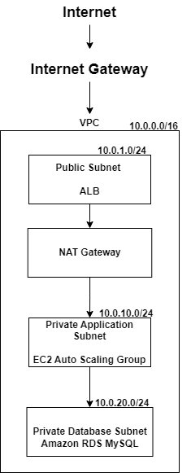

# AWS Three-Tier Architecture with Terraform
A highly available three-tier web application infrastructure deployed on AWS using Terraform.

## Overview

This project demonstrates how to deploy a three-tier architecture on AWS using Infrastructure as Code (IaC) with Terraform.

The architecture includes:

- Web Tier: Application Load Balancer
- Application Tier: EC2 Auto Scaling Group
- Database Tier: Amazon RDS MySQL

The infrastructure is designed with AWS best practices including:
- Public and private subnets
- Security group isolation
- IAM roles
- Multi-AZ networking

## Architecture
                Internet
                   |
                   |
              ALB (Public)
                   |
             Target Group
                   |
        ---------------------
        |                   |
     EC2 ASG            EC2 ASG
  Private subnet     Private subnet
        |
        |
       RDS
   Private subnet


## AWS Services Used

### Networking
- Amazon VPC
- Public/Private Subnets
- Internet Gateway
- NAT Gateway
- Route Tables

### Compute
- Amazon EC2
- Launch Template
- Auto Scaling Group

### Load Balancing
- Application Load Balancer
- Target Group

### Database
- Amazon RDS MySQL

### Security
- IAM Role
- Security Groups

### Infrastructure as Code
- Terraform

## Project Structure
```bash
aws-three-tier/

├── providers.tf

├── versions.tf

├── variables.tf

├── vpc.tf

├── subnet.tf

├── route-table.tf

├── nat.tf

├── security_group.tf

├── iam.tf

├── launch_template.tf

├── autoscaling.tf

├── alb.tf

├── target-group.tf

├── alb-attachment.tf

├── rds.tf

└── outputs.tf
```

## Deployment

### Initialize Terraform:

```bash
terraform init
terraform validate
terraform plan
terraform apply

```
## Outputs

- After deployment:

```bash
terraform output

```

## Cleanup

- To remove all AWS resources:

```bash
terraform destroy
```

## Future Improvements


- Add HTTPS with ACM certificate
- Add Route53 DNS
- Store database credentials in AWS Secrets Manager
- Add Terraform remote backend with S3 and DynamoDB locking
- Add CI/CD pipeline using GitHub Actions

## Architecture Diagram



## Maintenance

- Upgraded Amazon RDS for MySQL from 8.0.46 to 8.4.9 using Terraform.
- Enabled major version upgrade support and applied the change immediately.
- Verified that Terraform state matches AWS resources after upgrade.

## Demo

